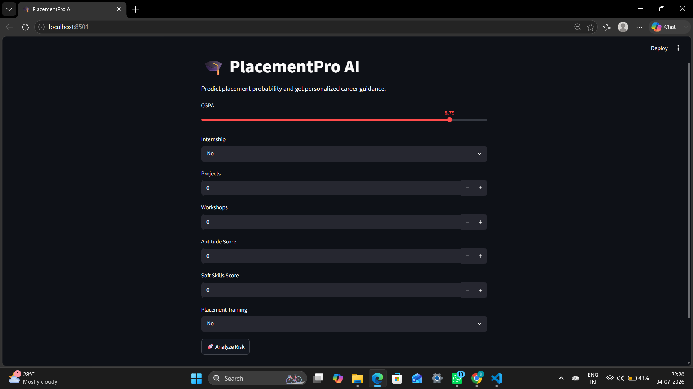
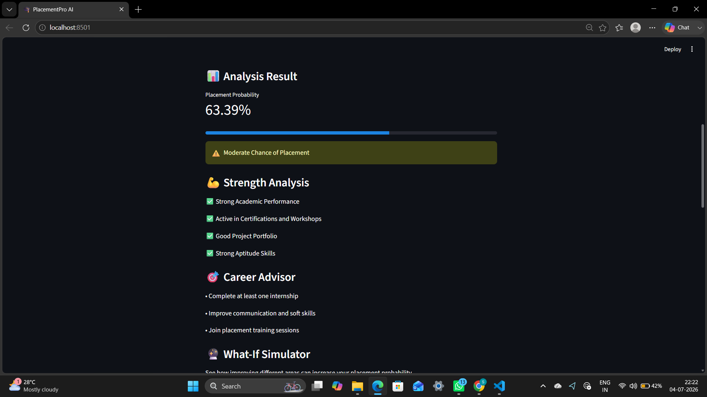
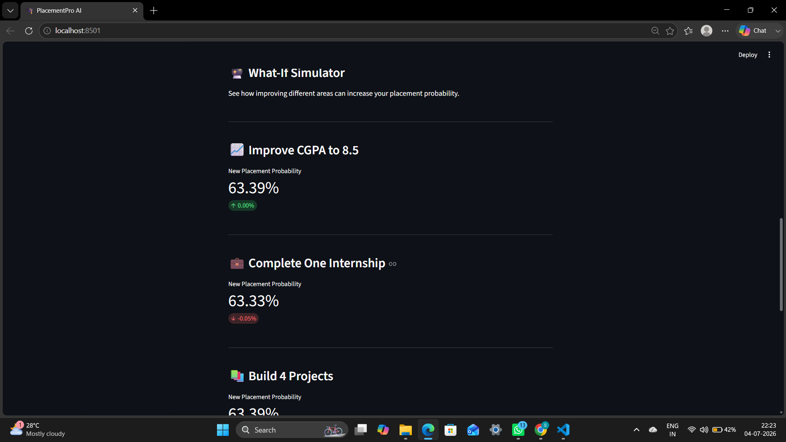
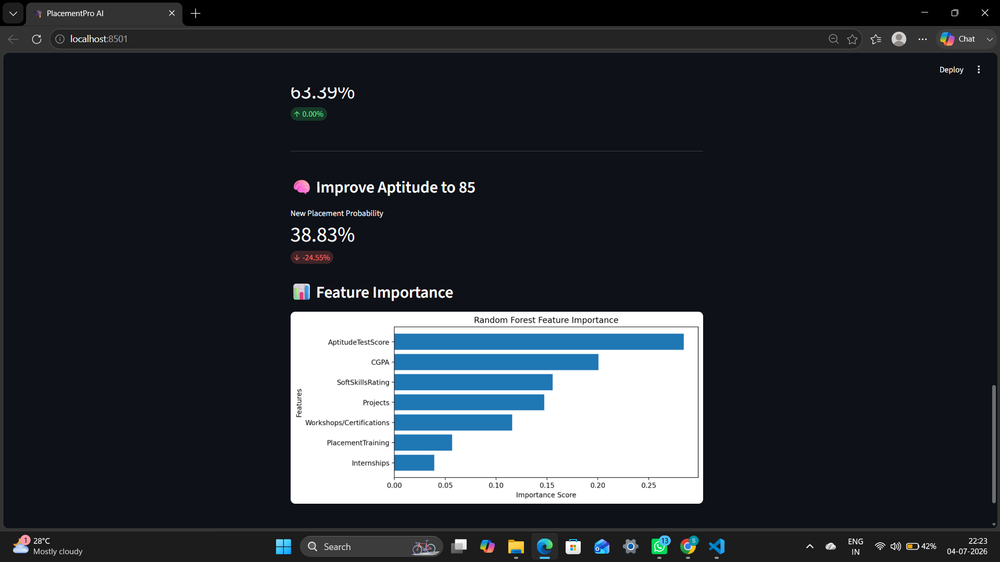

# 🎓 PlacementPro AI

> **An AI-powered Placement Prediction & Career Guidance System built using Machine Learning and Streamlit.**

 ## 🌐 Live Demo

**Live Application: https://placementproai-jxphpzos87xqhxxxjcfqpl.streamlit.app/

## 📌 Overview

PlacementPro AI helps students evaluate their placement readiness by predicting their placement probability based on academic and career-related parameters. The application also provides personalized career recommendations, highlights strengths, visualizes feature importance, and allows users to explore how improving specific skills could impact their placement chances.

---

## ✨ Features

- 🎯 Placement Probability Prediction
- 📊 Feature Importance Visualization
- 💪 Strength Analysis
- 📈 Personalized Career Recommendations
- 🔮 What-If Career Improvement Simulator
- 🌐 Interactive Streamlit Web Application

---

## 🛠️ Tech Stack

- Python
- Pandas
- NumPy
- Scikit-learn
- Random Forest Classifier
- SMOTE
- Streamlit
- Matplotlib
- Pickle

---

## 📂 Project Structure

```text
PlacementPro_AI/
│
├── app.py
├── data/
│   └── placementdata.csv
├── models/
│   ├── placement_model.pkl
│   └── scaler.pkl
├── src/
│   ├── train_model.py
│   ├── predict.py
│   └── save_model.py
├── images/
│   ├── home.png
│   ├── prediction.png
│   ├── career_advisor.png
│   ├── what_if.png
│   └── feature_importance.png
├── requirements.txt
├── README.md
└── .gitignore
```

---

## 📸 Application Preview

### 🏠 Home Page



---

### 📊 Placement Prediction



---

### 🎯 Career Recommendations


---

### 🔮 What-If Simulator



---

### 📈 Feature Importance



---

## ⚙️ Installation

Clone the repository:

```bash
git clone https://github.com/sibaramlenka/PlacementPro_AI.git
```

Move into the project directory:

```bash
cd PlacementPro_AI
```

Install dependencies:

```bash
pip install -r requirements.txt
```

Run the application:

```bash
streamlit run app.py
```

---

## 📊 Machine Learning Workflow

- Data Cleaning & Preprocessing
- Feature Selection
- Data Scaling (StandardScaler)
- Class Balancing using SMOTE
- Random Forest Model Training
- Model Evaluation
- Model Serialization using Pickle
- Interactive Prediction using Streamlit

---

## 📥 Input Features

- CGPA
- Internship Experience
- Number of Projects
- Workshops / Certifications
- Aptitude Test Score
- Soft Skills Rating
- Placement Training

---

## 📤 Output

The application provides:

- Placement Probability
- Placement Risk Level
- Strength Analysis
- Personalized Career Suggestions
- What-If Career Improvement Analysis
- Feature Importance Chart

---

## 🚀 Future Enhancements

- AI Resume Analyzer
- Explainable AI (SHAP)
- ATS Resume Score
- Career Roadmap Generator
- User Authentication
- Database Integration
- Cloud Deployment
- AI Interview Preparation Assistant

---

## 👨‍💻 Author

**Sibaram Lenka**

- GitHub: https://github.com/sibaramlenka
- LinkedIn: https://www.linkedin.com/in/sibaram-lenka-96020a344

---

## ⭐ If you found this project helpful, consider giving it a star!
